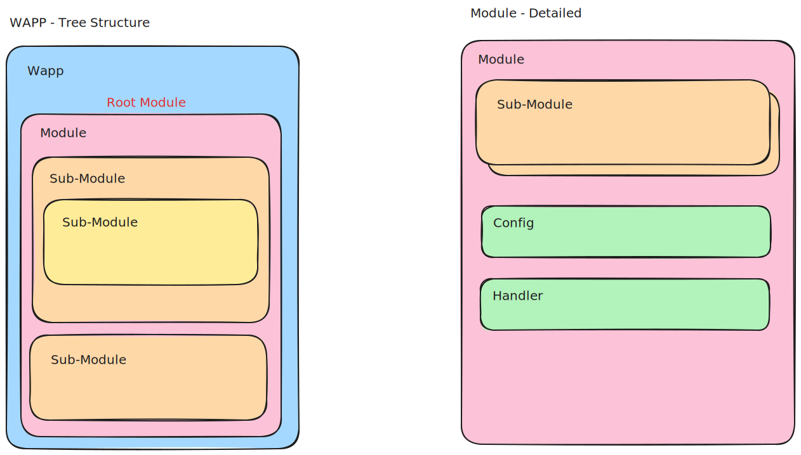
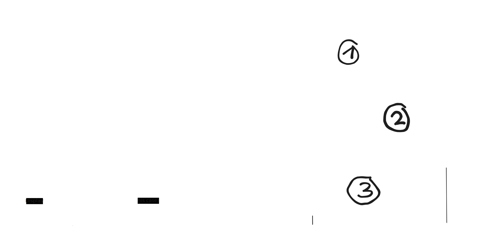

# Architecture

## Overview

### Example Request (HTML)

explanation to the numbers in image below:

1. pre transform before retrieval
2. retrieval / another transformation (calculation ...)
3. post transform after retrieval

## Module

* component
    * configuration
        * name
        * pathname
        * (is-root)
        * request method (should use CRUD??)
        * data-type
    * sub-module(s)
    * pre-action(s)
    * action(s)
    * post-action(s)

### "Request"

underneath is handler from gofiber

-- data passed in

when data get's here execute all user-provided pre-actions in order

-- data is passed on

then execute all actions (main) in order

-- data is passed on

after these run all post-actions in order

-- data passed out