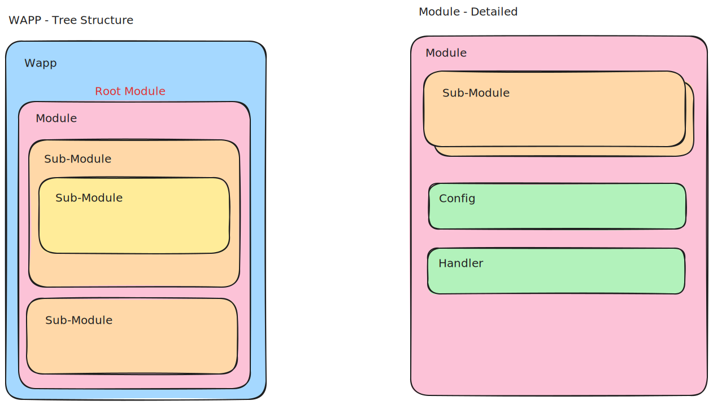

# wapp - web application part pot

> i forgot about the exact naming lol

but why does this exist.

well i wanted to build a front-/backend web framework.

## goals

* component architecture
* server side rendered components
* frontend html injection with htmx
* option to choose how output is rendered
	* html - for displaying with htmx
	* json - for building apis
	* xml - idk for lols
* each module should be able to:
	* add a parent menu
	* have submodules
	* have a page
	* have data endpoint
	* have validation options for endpoint
	* have data transformation options

## architecture

### example request

explanation to the numbers in image below:

1. pre transform before retrieval
2. retrieval / another transformation (calculation ...)
3. post transform after retrieval

